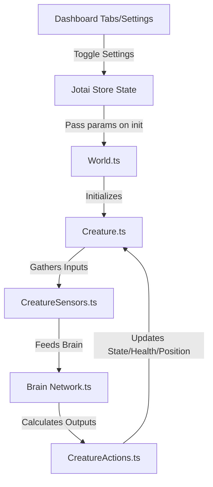

# React Biosim Evolution Roadmap 🚀

Welcome to the **React Biosim Enhancement Roadmap**! This guide outlines how to take the current TypeScript, Next.js, and React architecture of `react-biosim` and introduce game-changing features that will make the simulation feel like a living, breathing ecosystem.

This document breaks down proposed features into **architectural overviews**, **specific implementation steps**, and **code structures** tailored to your existing codebase (targeting `Creature.ts`, `CreatureSensors.ts`, `CreatureActions.ts`, and `World.ts`).

---

## Table of Contents
1. [🌟 Feature 1: Predator-Prey Dynamics & Energy Systems](#1-predator-prey-dynamics--energy-systems)
2. [🧪 Feature 2: Pheromones & Chemical Trail Following](#2-pheromones--chemical-trail-following)
3. [👁️ Feature 3: Directional Raycast Vision (Advanced Sensors)](#3-directional-raycast-vision-advanced-sensors)
4. [🧬 Feature 4: Sexual Reproduction (Genome Crossover)](#4-sexual-reproduction-genome-crossover)
5. [🧠 Feature 5: Real-Time Neural Network Brain Visualizer](#5-real-time-neural-network-brain-visualizer)

---

## 1. Predator-Prey Dynamics & Energy Systems

Currently, creatures survive solely by being in a specific static reproduction zone at the end of a generation. We can make the simulation a true survival-of-the-fittest sandbox by introducing **Energy**, **Food Spawning**, and **Combat Mechanics (Carnivores vs. Herbivores)**.

### How It Works
*   **Energy Level**: Every creature starts with `100` energy. Every step, they consume a base energy cost (e.g., `0.5`). Moving consumes extra energy (e.g., `0.5` per tile).
*   **Starvation**: If energy reaches `0`, the creature takes damage (`health -= 10` per step).
*   **Herbivores**: Creatures can eat food plants that randomly spawn on the grid.
*   **Carnivores**: Creatures can evolve an **Attack** action. If they attack an adjacent creature, they drain its health and convert it to energy/health for themselves.

### File Modifications & Code Tips

#### 📂 `simulation/world/World.ts`
We need to spawn food particles on the grid. Let's add a `foodGrid` or update `GridPoint` inside `World.ts`:

```typescript
// Update GridPoint in World.ts
type GridPoint = {
  creature: Creature | null;
  objects: WorldObject[];
  isSolid: boolean;
  foodAmount: number; // Add this line
};
```

Add a food-spawning mechanism inside `World.ts`'s step cycle:
```typescript
public spawnFood(amount: number) {
  for (let i = 0; i < amount; i++) {
    const [x, y] = this.getRandomPosition();
    if (!this.grid[x][y].isSolid && !this.grid[x][y].creature) {
      this.grid[x][y].foodAmount = Math.min(100, this.grid[x][y].foodAmount + 25);
    }
  }
}
```

#### 📂 `simulation/creature/Creature.ts`
Implement energy drain and health management inside `computeStep`:

```typescript
export default class Creature {
  // ... existing fields ...
  energy: number = 100;
  isCarnivore: boolean = false; // Determined by genome or configuration

  computeStep(): void {
    if (!this.isAlive) return;

    this.urgeToMove = [0, 0];

    // Base metabolic cost
    this.energy -= 0.5;

    // Brain feedforward & Action execution
    const outputs = this.calculateOutputs(this.calculateInputs());
    this.actions.executeActions(this, outputs);

    // Apply movement & movement energy cost
    const moveX = Math.tanh(this.urgeToMove[0]);
    const moveY = Math.tanh(this.urgeToMove[1]);
    const probX = probabilityToBool(Math.abs(moveX)) ? 1 : 0;
    const probY = probabilityToBool(Math.abs(moveY)) ? 1 : 0;

    if (probX !== 0 || probY !== 0) {
      this.move((moveX < 0 ? -1 : 1) * probX, (moveY < 0 ? -1 : 1) * probY);
      this.energy -= 0.5; // Movement energy penalty
    }

    // Starvation penalty
    if (this.energy <= 0) {
      this.energy = 0;
      this.health -= 5; // Starve over time
    }

    // Herbivore feeding: check if standing on food
    if (!this.isCarnivore) {
      const tile = this.world.grid[this.position[0]][this.position[1]];
      if (tile.foodAmount > 0) {
        const eatAmount = Math.min(tile.foodAmount, 50);
        tile.foodAmount -= eatAmount;
        this.energy = Math.min(100, this.energy + eatAmount);
      }
    }
  }
}
```

#### 📂 `simulation/creature/actions/CreatureActions.ts`
Add an `Attack` action:

```typescript
export type ActionName =
  | "MoveNorth" | "MoveSouth" | "MoveEast" | "MoveWest"
  | "RandomMove" | "MoveForward"
  | "Attack"; // Add Attack action
```

In `executeActions(creature, values)`:
```typescript
if (this.data.Attack.enabled && input > 0.5) {
  // Attack adjacent cells
  const directions = [[0, 1], [1, 0], [0, -1], [-1, 0]];
  for (const [dx, dy] of directions) {
    const targetX = creature.position[0] + dx;
    const targetY = creature.position[1] + dy;
    if (creature.world.isTileInsideWorld(targetX, targetY)) {
      const target = creature.world.grid[targetX][targetY].creature;
      if (target && target.isAlive) {
        target.health -= 30; // Deal damage
        creature.energy = Math.min(100, creature.energy + 20); // Absorb energy
        creature.isCarnivore = true; // Dynamically adapt or reinforce feeding type
        break;
      }
    }
  }
}
```

---

## 2. Pheromones & Chemical Trail Following

Ants and other social insects coordinate by leaving pheromone chemical trails. Implementing this enables creatures to communicate paths dynamically—such as marking danger areas or indicating food sources.

### How It Works
*   **Pheromone Map**: The `World` maintains a 2D float grid representation of pheromones on the map, which evaporates slowly over time (e.g., `-2%` per step).
*   **Emit Pheromone Action**: A creature's action node triggers the deposition of pheromones on their current tile.
*   **Pheromone Sensors**: Sensor inputs feed into the neural network, allowing creatures to smell pheromones left/right/front of them to follow or avoid trails.

### File Modifications & Code Tips

#### 📂 `simulation/world/World.ts`
Implement the chemical grid and evaporation:

```typescript
export default class World {
  pheromoneGrid: number[][] = []; // 2D array matched with grid size

  private initializeGrid(): void {
    // ... your current grid setup ...
    this.pheromoneGrid = Array(this.size).fill(0).map(() => Array(this.size).fill(0));
  }

  // Inside step calculations:
  public evaporatePheromones() {
    for (let x = 0; x < this.size; x++) {
      for (let y = 0; y < this.size; y++) {
        if (this.pheromoneGrid[x][y] > 0) {
          this.pheromoneGrid[x][y] *= 0.95; // Evaporate 5% per step
          if (this.pheromoneGrid[x][y] < 0.01) this.pheromoneGrid[x][y] = 0;
        }
      }
    }
  }
}
```

#### 📂 `simulation/creature/actions/CreatureActions.ts`
Create the Action to deposit chemical trails:

```typescript
// 1. Add "EmitPheromone" to ActionName
// 2. Add it to the default this.data Record

if (this.data.EmitPheromone.enabled && input > 0.5) {
  const [x, y] = creature.position;
  creature.world.pheromoneGrid[x][y] = Math.min(1.0, creature.world.pheromoneGrid[x][y] + input);
}
```

#### 📂 `simulation/creature/sensors/CreatureSensors.ts`
Add chemical sensors so they can perceive paths:

```typescript
// 1. Add "PheromoneScent" to SensorName
// 2. Under calculateOutputs:
if (this.data.PheromoneScent.enabled) {
  // Query adjacent cell pheromones (e.g., North, East, South, West)
  const adjacent = [[0, -1], [1, 0], [0, 1], [-1, 0]];
  for (const [dx, dy] of adjacent) {
    const tx = creature.position[0] + dx;
    const ty = creature.position[1] + dy;
    if (creature.world.isTileInsideWorld(tx, ty)) {
      values.push(creature.world.pheromoneGrid[tx][ty]);
    } else {
      values.push(0);
    }
  }
}
```

---

## 3. Directional Raycast Vision (Advanced Sensors)

Currently, the `Touch` sensor only looks exactly 1 block away in the primary cardinal directions. Real creatures cast rays to see obstacles or targets at a distance. Let's introduce **Raycast Vision**.

### How It Works
*   The creature casts a sensory ray in the direction of its last movement (or diagonal offsets: -45°, 0°, +45°).
*   The ray extends up to a max vision distance (e.g., 6 cells).
*   The sensor output represents the proximity to the first obstacle/creature found (`1.0` if touching, `0.0` if nothing seen within max distance).

```
          [Obstacle] (Dist = 3) -> Output = 0.5
            ^
            |
            | (Raycast)
         [Creature] (Facing North)
```

### File Modifications & Code Tips

#### 📂 `simulation/creature/sensors/CreatureSensors.ts`
Modify the sensor registry to include vision cones:

```typescript
export type SensorName = 
  | "VisionFront" 
  | "VisionLeft" 
  | "VisionRight"
  | "VisionFoodFront"
  // ... existing sensors ...
```

Implement raycasting calculations inside `calculateOutputs`:

```typescript
function performRaycast(
  creature: Creature, 
  dirX: number, 
  dirY: number, 
  maxDistance: number,
  lookForFood: boolean = false
): number {
  let cx = creature.position[0];
  let cy = creature.position[1];

  for (let dist = 1; dist <= maxDistance; dist++) {
    const tx = cx + dirX * dist;
    const ty = cy + dirY * dist;

    if (!creature.world.isTileInsideWorld(tx, ty)) {
      return 1.0 - (dist - 1) / maxDistance; // Border obstacle hit
    }

    const tile = creature.world.grid[tx][ty];

    if (lookForFood && tile.foodAmount > 0) {
      return 1.0 - (dist - 1) / maxDistance; // Food found
    }

    if (tile.isSolid || tile.creature) {
      return 1.0 - (dist - 1) / maxDistance; // Solid obstacle/creature hit
    }
  }

  return 0; // Clear path
}
```

Integrate with outputs inside `calculateOutputs(creature)`:

```typescript
// Get creature heading based on last movement
let dx = creature.lastMovement[0];
let dy = creature.lastMovement[1];

// Default to North if they haven't moved yet
if (dx === 0 && dy === 0) {
  dx = 0;
  dy = -1;
}

// Front Vision
if (this.data.VisionFront.enabled) {
  values.push(performRaycast(creature, dx, dy, 6));
}

// Left/Right vision can be calculated by rotating the vector [dx, dy] by 90 degrees
if (this.data.VisionLeft.enabled) {
  // Rotate [dx, dy] left: (x, y) -> (y, -x)
  values.push(performRaycast(creature, dy, -dx, 4));
}
if (this.data.VisionRight.enabled) {
  // Rotate [dx, dy] right: (x, y) -> (-y, x)
  values.push(performRaycast(creature, -dy, dx, 4));
}
```

---

## 4. Sexual Reproduction (Genome Crossover)

Currently, survivors reproduce asexually. The next generation is populated by making clones of survivors with slight single-gene mutations. By implementing **Genome Crossover (Sexual Reproduction)**, we allow features from two distinct successful genomes to combine, exponentially accelerating survival learning rates!

```
Parent A Genome: [Gene A1, Gene A2, Gene A3, Gene A4]
Parent B Genome: [Gene B1, Gene B2, Gene B3, Gene B4]
                             ↓ (Single-point crossover)
Child Genome:    [Gene A1, Gene A2, B3, B4]
```

### File Modifications & Code Tips

#### 📂 `simulation/creature/genome/Genome.ts`
Implement a crossover method:

```typescript
export default class Genome {
  // ... existing cloning/mutation code ...

  /**
   * Performs a single-point crossover with another genome.
   */
  public crossover(other: Genome): Genome {
    const childGenes: number[] = [];
    const minLength = Math.min(this.genes.length, other.genes.length);
    
    // Choose a random crossover pivot point
    const crossoverPoint = Math.floor(Math.random() * minLength);

    for (let i = 0; i < minLength; i++) {
      if (i < crossoverPoint) {
        childGenes.push(this.genes[i]);
      } else {
        childGenes.push(other.genes[i]);
      }
    }

    // Append any extra genes from either parent based on chance
    const longerGenome = this.genes.length > other.genes.length ? this : other;
    for (let i = minLength; i < longerGenome.genes.length; i++) {
      if (Math.random() > 0.5) {
        childGenes.push(longerGenome.genes[i]);
      }
    }

    return new Genome(childGenes);
  }
}
```

#### 📂 `simulation/creature/population/AsexualRandomPopulation.ts` (or a new `SexualPopulation.ts`)
Instead of copying a single parent, randomly select two surviving parents and cross them over:

```typescript
// Inside populate(world, survivors):
const nextGeneration: Creature[] = [];

while (nextGeneration.length < world.initialPopulation) {
  // Select two random survivors
  const parentA = survivors[Math.floor(Math.random() * survivors.length)];
  const parentB = survivors[Math.floor(Math.random() * survivors.length)];
  
  // Combine genomes
  const childGenome = parentA.genome.crossover(parentB.genome);
  
  // Apply standard mutations on the combined genome
  const mutatedGenome = childGenome.clone(
    true, 
    world.mutationMode, 
    world.maxGenomeSize, 
    world.mutationProbability,
    world.geneInsertionDeletionProbability,
    world.deletionRatio
  );

  const spawnPos = world.getRandomAvailablePosition();
  nextGeneration.push(new Creature(world, spawnPos, mutatedGenome));
}
```

---

## 5. Real-Time Neural Network Brain Visualizer

One of the most requested features for evolution simulators is seeing the **creature's brain operate in real-time**. We can render the neural network of the currently selected creature on a side panel using a modular HTML5 Canvas or SVG!

### How to Build It
1.  **Selection Handler**: Add a click listener to the `SimulationCanvas` to identify which creature was clicked. Set it as the "Active/Inspected Creature" in Jotai state.
2.  **Render Brain Topology**: Read the connections from `creature.brain.connections` and `creature.brain.neurons`.
3.  **Color Codes**:
    *   Draw **Sensor nodes** on the left.
    *   Draw **Hidden neurons** in the middle.
    *   Draw **Action nodes** on the right.
    *   Render connections as lines. Color them **Green/Blue** for positive weights (excitatory) and **Red/Orange** for negative weights (inhibitory).
    *   Draw thick animated signals traversing the connections to show real-time firing status.

### Component Code Structure (New React Component)

Create a new file: `components/simulation/BrainVisualizer.tsx`

```tsx
import React, { useEffect, useRef } from "react";
import Creature from "@/simulation/creature/Creature";

interface BrainVisualizerProps {
  creature: Creature | null;
}

export default function BrainVisualizer({ creature }: BrainVisualizerProps) {
  const canvasRef = useRef<HTMLCanvasElement>(null);

  useEffect(() => {
    if (!creature || !canvasRef.current) return;
    const canvas = canvasRef.current;
    const ctx = canvas.getContext("2d")!;
    let animationId: number;

    const draw = () => {
      ctx.clearRect(0, 0, canvas.width, canvas.height);
      
      // 1. Gather all connections and active inputs/outputs
      const { connections, neurons, inputCount, outputCount } = creature.brain;

      // 2. Define layout coordinates for nodes
      // (Sensors left, Neurons center, Actions right)
      // Draw connection lines with thickness based on synapse weight
      connections.forEach((conn) => {
        ctx.beginPath();
        ctx.strokeStyle = conn.weight > 0 ? "rgba(34, 197, 94, 0.6)" : "rgba(239, 68, 68, 0.6)";
        ctx.lineWidth = Math.abs(conn.weight);
        
        // Locate coordinates for source and sink nodes ...
        // ctx.moveTo(srcX, srcY);
        // ctx.lineTo(sinkX, sinkY);
        ctx.stroke();
      });

      // 3. Draw nodes as colored circles
      // Highlight active node circles based on their current output values

      animationId = requestAnimationFrame(draw);
    };

    draw();
    return () => cancelAnimationFrame(animationId);
  }, [creature]);

  if (!creature) {
    return <div className="text-gray-400 p-4">Click a creature to inspect its neural network</div>;
  }

  return (
    <div className="bg-slate-900 border border-slate-700 rounded-lg p-4">
      <h3 className="text-lg font-bold mb-2">Creature Brain Visualizer</h3>
      <canvas ref={canvasRef} width={400} height={300} className="w-full h-auto bg-black rounded" />
    </div>
  );
}
```

---

## Summarized Modification Path 🗺️

To make integration simple, here are the paths to modify or add settings inside your dashboard UI:



Implementing even one of these enhancements will elevate `react-biosim` from an exciting demonstration into a highly educational and addictive complex sandbox. Happy coding! 🚀
